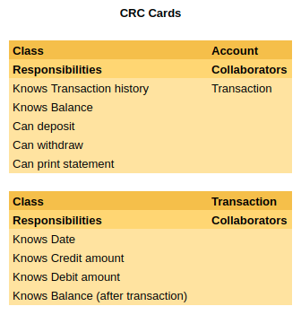

# Bank - Python <!-- omit in toc -->

This is a small project to practice maintaining code quality and process. [Source]

I have previously created a Ruby implementation, [available here](https://github.com/hturnbull93/bank/).
I have also created a JavaScript implementation for the [browser](https://github.com/hturnbull93/bank-js/), and in [node](https://github.com/hturnbull93/bank-node/).

It allows you to create an account, deposit funds into it, withdraw funds from it, and print statements.

- [Spec](#spec)
  - [Requirements](#requirements)
  - [Acceptance criteria](#acceptance-criteria)
- [Quick Start](#quick-start)
- [Screen Preview](#screen-preview)
- [Dependencies](#dependencies)
- [Development Journal](#development-journal)
  - [Domain Modelling](#domain-modelling)
  - [User Stories](#user-stories)
  - [Set up](#set-up)
  - [Deposits](#deposits)

## Spec

### Requirements

- You should be able to interact with your code via a REPL like IRB or the JavaScript console. (You don't need to implement a command line interface that takes input from STDIN.)
- Deposits, withdrawal.
- Account statement (date, amount, balance) printing.
- Data can be kept in memory (it doesn't need to be stored to a database or anything).

### Acceptance criteria

**Given** a client makes a deposit of 1000 on 10-01-2012  
**And** a deposit of 2000 on 13-01-2012  
**And** a withdrawal of 500 on 14-01-2012  
**When** she prints her bank statement  
**Then** she would see:

```irb
date || credit || debit || balance
14/01/2012 || || 500.00 || 2500.00
13/01/2012 || 2000.00 || || 3000.00
10/01/2012 || 1000.00 || || 1000.00
```

## Quick Start

Coming soon.

## Screen Preview

Coming soon.

## Dependencies

Development:

[pytest] - Testing framework

## Development Journal

### Domain Modelling

Given that I know more about the final form of the program from the previous implementations, this project focusses more on the implementation rather than the planning steps. The below CRC modelling and User Stories are taken from the Ruby implementation.

CRC modelling:



### User Stories

- [ ] 1

> As a Bank Manager,  
> So that we only take customers money,  
> I want accounts to start with balance 0

- [ ] 2

> As a Customer,  
> So I can keep my money safe,  
> I want to be able to deposit into my account

- [ ] 3

> As a Customer,  
> So I can spend my money,  
> I want to be able to withdraw from my account

- [ ] 3.1

> As a Bank Manager,  
> So we don't go out of pocket,  
> I want withdrawals to only be allowed to occur if the customer has sufficient funds

- [ ] 4

> As a Customer,  
> So I can keep on top of my finances,  
> I want to be able to print my account statement

- [ ] 4.1

> As a Customer,  
> So I know when each transaction happened,  
> I want transactions on my statement to have the date

- [ ] 4.2

> As a Customer,  
> So I know how much each deposit was,  
> I want deposits on my statement to have the credit amount.

- [ ] 4.3

> As a Customer,  
> So I know how much each withdrawal was,  
> I want withdrawals on my statement to have the debit amount.

- [ ] 4.4

> As a Customer,  
> So can keep track of my balance,  
> I want transactions on my statement to have the balance amount after the transaction was completed.

- [ ] 4.5

> As a Customer,  
> Because more recent transactions are more important to me,  
> I want the statement transactions to be ordered from newest to oldest.

### Set up

This is my first ever Python project.

I am using Python 3.8.3.

For my tests I am using pytest, installed with:

```shell
pip install -U pytest
```

### Deposits

- [ ] 1

> As a Bank Manager,  
> So that we only take customers money,  
> I want accounts to start with balance 0

- [ ] 2

> As a Customer,  
> So I can keep my money safe,  
> I want to be able to deposit into my account

In `test/account_test.py`:

Wrote a test for an `Account` class, with a `deposit` method taking 100 results in a string showing deposited 100 and balance of 100. Red.


<!-- links -->

[pytest]: https://docs.pytest.org/en/latest/